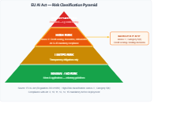
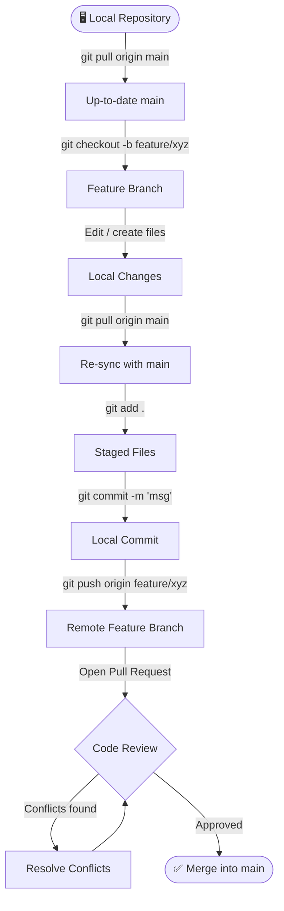

<div align="center">

# NovaCred Data Governance Task Force
### DEGO-2606 · Group TXC12 · Credit Application Governance Analysis


</div>

---

## Table of Contents

1. [Project Description](#project-description)
2. [Team & Contributions](#team--contributions)
3. [Repository Structure](#repository-structure)
4. [Version Control & Collaboration](#version-control--collaboration)
5. [Notebook 01 — Data Quality Assessment](#notebook-01--data-quality-assessment)
6. [Notebook 02 — Algorithmic Bias Analysis](#notebook-02--algorithmic-bias-analysis)
7. [Notebook 03 — Privacy & Compliance Analysis](#notebook-03--privacy--compliance-analysis)

---

## Project Description

This project conducts a full data governance audit of **NovaCred's credit application system** across 496 records, covering data quality, algorithmic fairness, and GDPR/EU AI Act compliance. We identify systematic discrimination against female and younger applicants (Disparate Impact as low as 0.667), 9 distinct GDPR violations with zero governance infrastructure across all records, and classify the credit scoring system as **High-Risk AI** under EU AI Act Annex III, Category 5(b) — meeting 0 of 6 mandatory requirements. The analysis culminates in a prioritised 10-control governance roadmap designed to bring NovaCred into regulatory compliance within 180 days.

<div align="center">



</div>

---

## Team & Contributions

| Name | Matr. Nr. | Role | Primary Responsibility | Contribution |
|------|-----------|------|------------------------|:------------:|
| **Jonas Dittrich** | 71637 | Product Lead · Data Engineer | Notebook 01, Presentation, README | 33.33 % |
| **Simon Anthofer** | 71078 | Product Lead · Data Scientist | Notebook 02, Presentation, README | 33.33 % |
| **Marie Christine Henke** | 73606 | Product Lead · Governance Officer | Notebook 03, Presentation, README | 33.33 % |

> All team members held equal Product Lead responsibility and contributed equally to the final deliverables.

---

## Repository Structure

```
DEGO-2606---TXC_12/
│
├── data/
│   ├── raw_credit_applications.json   ← Original dataset (502 records)
│   └── data_cleaned.json              ← Cleaned & standardised dataset (496 records)
│
├── notebooks/
│   ├── 01 - data - quality.ipynb      ← Data Quality Assessment (Jonas Dittrich)
│   ├── 02 - bias - analysis.ipynb     ← Algorithmic Bias Analysis (Simon Anthofer)
│   └── 03 - privacy - demo.ipynb      ← Privacy & Compliance Analysis (Marie Henke)
│
├── presentation/
│   ├── slides.pptx                    ← Presentation slides
│   └── presentation_video.mp4         ← Recorded presentation video
│
├── README.md
└── LICENSE
```

---

## Version Control & Collaboration

Every contribution followed a **branch-based Git workflow** to ensure isolated development, traceability, and conflict-free integration into `main`.


### Workflow Diagram



---

## Notebook 01 — Data Quality Assessment

> **Author:** Jonas Dittrich &nbsp;|&nbsp; **Tools:** MongoDB, pandas, matplotlib, seaborn, re

This notebook performs a comprehensive 6-dimension data quality audit of the raw NovaCred credit application dataset loaded from MongoDB. Six audit queries systematically identify and resolve issues of consistency, completeness, validity, and uniqueness — transforming 502 raw records into 496 analysis-ready records exported as `data_cleaned.json`.

### Key Findings & Metrics

| Audit Dimension | Issue | Records Affected | Severity | Action Taken |
|-----------------|-------|:----------------:|:--------:|--------------|
| **Consistency** | `annual_income` stored as mixed types (int, float, string) | 9 | 🟠 HIGH | Converted all to `int` |
| **Consistency** | `annual_income` aliased as `annual_salary` in 5 records | 5 | 🟠 HIGH | Renamed to `annual_income` |
| **Consistency** | `gender` encoded as `"M"` / `"F"` instead of full word | 111 | 🟠 HIGH | Standardised to `"Male"` / `"Female"` |
| **Consistency** | `date_of_birth` in 7 different formats | 157 | 🔴 CRITICAL | Standardised to ISO 8601 (`YYYY-MM-DD`); 57 flagged as ambiguous |
| **Completeness** | Missing `date_of_birth` | 5 | 🟠 HIGH | Dropped (< 1 %, random distribution) |
| **Completeness** | Missing `gender` | 3 | 🟡 MEDIUM | 2 resolved via first name; 1 removed (duplicate) |
| **Completeness** | Missing `annual_income` | 5 | 🟠 HIGH | Resolved via `annual_salary` rename |
| **Completeness** | Missing `SSN` / `IP address` | 5 each | 🟡 MEDIUM | Documented; no imputation |
| **Validity** | Zero annual income | 1 | 🟠 HIGH | Set to `None` |
| **Validity** | Negative credit history months | 2 | 🟠 HIGH | Set to `None` |
| **Validity** | DTI outlier of 1.85 (impossible) | 1 | 🟠 HIGH | Set to `None` |
| **Validity** | Negative savings balance | 1 | 🟠 HIGH | Set to `None` |
| **Validity** | Invalid email format | 4 | 🟡 MEDIUM | Set to `None` |
| **Uniqueness** | True duplicate record (`app_001` — Stephanie Nguyen) | 1 | 🔴 CRITICAL | Removed |
| **Uniqueness** | Resubmission flagged in notes (Joseph Lopez) | 1 | 🟡 MEDIUM | Retained (legitimate resubmission) |
| **Uniqueness** | Duplicate SSNs across different applicants | 2 pairs | 🟠 HIGH | Documented; no deletion possible |

### Summary

Starting from **502 raw records**, the pipeline removed **6 records** (1 true duplicate + 5 missing DOB cases) and resolved all type, encoding, and format inconsistencies in-memory. The resulting **496-record `data_cleaned.json`** is the single source of truth for Notebooks 02 and 03.

---

## Notebook 02 — Algorithmic Bias Analysis

> **Author:** Simon Anthofer &nbsp;|&nbsp; **Tools:** pandas, numpy, scipy, fairlearn, scikit-learn, seaborn

This notebook analyses algorithmic fairness in NovaCred's credit approval decisions across **496 applications** using Disparate Impact (DI) ratios, Chi-square tests, Mann-Whitney U tests, Spearman correlations, logistic regression LRT interaction tests, and K-Means clustering. The analysis establishes that gender and age discrimination is **systematic and statistically confirmed**, with the youngest female applicants facing a compound disadvantage.

### Disparate Impact Formula

The **Disparate Impact Ratio (DI)** measures whether an unprivileged group receives favourable outcomes at a proportionally lower rate than a privileged group. The widely adopted regulatory threshold is the **Four-Fifths (80 %) Rule**: a DI below 0.8 indicates adverse impact.

$$DI = \frac{P(\hat{Y}=1 \mid A=\text{unprivileged})}{P(\hat{Y}=1 \mid A=\text{privileged})}$$

Where $\hat{Y}=1$ denotes a positive decision (loan approved) and $A$ is the protected attribute (e.g. gender, age group). A value of $DI < 0.8$ violates the Four-Fifths Rule; $DI = 1.0$ indicates perfect parity.

For the gender case in this analysis:

$$DI_{\text{gender}} = \frac{P(\text{Approved} \mid \text{Female})}{P(\text{Approved} \mid \text{Male})} = \frac{0.5081}{0.6573} = 0.773 \quad \Rightarrow \quad \text{Four-Fifths Rule violated}$$

### Key Findings & Metrics

| Category | Finding | Key Metric | Severity | Statistical Significance |
|----------|---------|:----------:|:--------:|:----------------------:|
| **Gender (Primary)** | Females approved at 50.81 % vs males at 65.73 % | DI = **0.773** | 🔴 CRITICAL | p = 0.001 ✅ |
| **Age — Median Split** | Below-median age (< 39): 50.21 % vs above: 65.40 % | DI = **0.769** | 🔴 CRITICAL | p < 0.05 ✅ |
| **Age — Groups** | Applicants < 30: 41.49 % vs 50+: 57.61 % | DI = **0.720** | 🔴 CRITICAL | p < 0.05 ✅ |
| **Intersectional — Females < 30** | Lowest approval in entire dataset | DI = **0.667** | 🔴 CRITICAL | p = 0.250 ❌ (small n) |
| **Intersectional — Females 41–50** | Gender gap persists despite highest female income ($104.7 k) | DI = **0.793** | 🔴 CRITICAL | p < 0.05 ✅ |
| **Proxy — Credit History** | Strongest age proxy; +9 months for approved applicants | ρ = **0.63** vs age | 🟠 HIGH RISK | p < 0.001 ✅ |
| **Proxy — Annual Income** | $17.6 k gap; income proxies age structurally | ρ = **0.48** vs age | 🟡 MODERATE | p < 0.001 ✅ |
| **Proxy — Savings Balance** | $4.5 k gap for approved; interacts with gender | ρ = **0.37** vs age | 🟠 MODERATE RISK | p = 0.038 ✅ |
| **Proxy — ZIP Code** | K-Means Cluster 0: 87.9 % vs Cluster 1: 45.9 % approval at similar income | 42 pp gap | 🟠 MODERATE RISK | p = 0.139 ❌ (low power) |
| **Proxy — Debt-to-Income** | No relationship with approval or gender | ρ = **−0.008** | 🟢 LOW RISK | p = 0.866 ❌ |
| **Proxy — Spending Behaviour** | Visible category differences but insufficient sample power | Not significant | 🟢 LOW RISK | p > 0.05 ❌ |
| **Proxy — Loan Purpose** | 90 % "Not specified" — data quality barrier | Not significant | 🟢 LOW RISK | p > 0.05 ❌ |

### Intersectional Breakdown (Gender × Age)

| Age Group | Female Approval | Male Approval | DI (F/M) | Four-Fifths Status |
|-----------|:--------------:|:------------:|:--------:|:-----------------:|
| 18–30 | 33.3 % | 50.0 % | **0.667** | ⚠️ Severe violation |
| 31–40 | 52.9 % | 65.6 % | **0.807** | ✅ Borderline |
| 41–50 | 60.9 % | 76.8 % | **0.793** | ⚠️ Violation |
| 50+ | 51.0 % | 65.1 % | **0.784** | ⚠️ Violation |

### Governance Recommendations

| Priority | Recommendation |
|:--------:|----------------|
| 🔴 **Immediate** | Introduce gender-stratified approval thresholds and mandatory bias audits per decision batch |
| 🔴 **Immediate** | Replace raw `credit_history_months` with an age-normalised metric (e.g. credit utilisation relative to years eligible) |
| 🟠 **Short-Term** | Apply age-relative income thresholds to prevent mechanical age discrimination via income criterion |
| 🟠 **Short-Term** | Implement ZIP-level fairness monitoring; evaluate whether geographic features should be excluded from the model |
| 🟡 **Medium-Term** | Redesign loan-purpose data collection (currently 90 % missing) to enable purpose-based fairness analysis |
| 🟡 **Medium-Term** | Expand spending-category sample sizes before using spending data as a model feature |

---

## Notebook 03 — Privacy & Compliance Analysis

> **Author:** Marie Christine Henke &nbsp;|&nbsp; **Tools:** pandas, numpy, hashlib, hmac, secrets, matplotlib, seaborn

This notebook conducts a full GDPR and EU AI Act audit of NovaCred's credit application dataset. It finds that **NovaCred has no functioning governance infrastructure**: all 5 direct PII fields are stored in plaintext, all 6 mandatory GDPR governance fields are absent from every record, and the credit scoring system qualifies as High-Risk AI under EU AI Act Annex III — meeting 0 of 6 mandatory requirements. The notebook demonstrates pseudonymisation of SSN and email via HMAC-SHA256 and proposes a 10-control governance roadmap.

### Key Findings & Metrics

#### Direct PII Inventory

| Field | GDPR Category | Sensitivity | Necessary for Decision | Records Present |
|-------|--------------|:-----------:|:---------------------:|:---------------:|
| `full_name` | Art. 4(1) Personal Data | 🟠 HIGH | ✅ Yes | 496 / 496 (100 %) |
| `date_of_birth` | Art. 4(1) Personal Data | 🟠 HIGH | ✅ Yes | 496 / 496 (100 %) |
| `email` | Art. 4(1) Personal Data | 🟠 HIGH | ❌ No — candidate for removal | 496 / 496 (100 %) |
| `ssn` | National ID — Special Category | 🔴 CRITICAL | ❌ No — candidate for removal | 495 / 496 (99.8 %) |
| `ip_address` | Art. 4(1) / CJEU C-582/14 | 🟡 MEDIUM | ❌ No — candidate for removal | 495 / 496 (99.8 %) |

#### Quasi-Identifier Re-identification Risk (k-Anonymity)

| Combination | k-min | k-median | % Uniquely Identifiable Groups | Risk Level |
|-------------|:-----:|:--------:|:------------------------------:|:----------:|
| ZIP + Gender + Age band | **1** | 1.0 | **85.8 %** | 🔴 HIGH RISK |
| ZIP + Age band | 1 | 1.0 | 83.1 % | 🔴 HIGH RISK |
| ZIP + Gender | 1 | 2.0 | 42.9 % | 🔴 HIGH RISK |
| ZIP only | 1 | 2.0 | 25.8 % | 🔴 HIGH RISK |
| Gender + Age band | 5 | — | 0.0 % | 🟠 MODERATE |

#### GDPR Governance Gap (Mandatory Fields)

| Field | GDPR Article | Principle | Records Present | Status |
|-------|-------------|-----------|:---------------:|:------:|
| `consent_timestamp` | Art. 6 + Art. 7 | Lawful Basis | 0 / 496 | 🔴 MISSING |
| `retention_until` | Art. 5(1)(e) | Storage Limitation | 0 / 496 | 🔴 MISSING |
| `processing_purpose` | Art. 5(1)(b) | Purpose Limitation | 0 / 496 | 🔴 MISSING |
| `data_source` | Art. 14 + Art. 30 | Transparency | 0 / 496 | 🔴 MISSING |
| `human_review_flag` | Art. 22 | Human Oversight | 0 / 496 | 🔴 MISSING |
| `audit_trail` | Art. 5(2) | Accountability | 0 / 496 | 🔴 MISSING |

#### GDPR Violations Mapped

| # | Issue | GDPR Article | Severity |
|---|-------|-------------|:--------:|
| 1 | Direct PII stored in plaintext (SSN, email, name, IP, DoB) | Art. 5(1)(f) + Art. 25 | 🔴 CRITICAL |
| 2 | SSN and IP address not needed for credit decision | Art. 5(1)(c) | 🟠 HIGH RISK |
| 3 | No consent timestamp or lawful basis field | Art. 6 + Art. 7 | 🔴 CRITICAL |
| 4 | No retention deadline — data may be kept indefinitely | Art. 5(1)(e) | 🔴 CRITICAL |
| 5 | No mechanism to respond to deletion requests | Art. 17 | 🟠 HIGH RISK |
| 6 | No purpose documentation per record | Art. 5(1)(b) | 🔴 CRITICAL |
| 7 | No data source field — origin unknown | Art. 14 + Art. 30 | 🟠 HIGH RISK |
| 8 | Fully automated decisions with no human review flag | Art. 22 | 🔴 CRITICAL |
| 9 | ZIP + Gender + Age creates re-identification risk | Art. 4(1) + Recital 26 | 🔴 CRITICAL |

> **Regulatory Exposure:** Up to **€20M or 4 % of global annual turnover** under Art. 83(5) for lawful basis violations; up to **€10M or 2 %** under Art. 83(4) for organisational measure failures.

#### EU AI Act Compliance (High-Risk — Annex III, Category 5(b))

| Requirement | Article | Status |
|-------------|---------|:------:|
| Risk Management System | Art. 9 | ❌ NOT MET |
| Data Governance & Quality (bias-free, representative data) | Art. 10 | ❌ NOT MET |
| Technical Documentation | Art. 11 | ❌ NOT MET |
| Transparency & Instructions for Use | Art. 13 | ⚠️ PARTIAL |
| Human Oversight | Art. 14 | ❌ NOT MET |
| Accuracy, Robustness & Cybersecurity | Art. 15 | ⚠️ PARTIAL |

> **Verdict: 4 NOT MET · 2 PARTIAL · 0 FULLY COMPLIANT** — NovaCred must achieve full compliance before deployment.

### Governance Roadmap

| Priority | Timeline | Control | Type | GDPR / AI Act Article |
|:--------:|----------|---------|------|----------------------|
| 🔴 **Immediate** | 0–30 days | Pseudonymisation pipeline (HMAC-SHA256) | Technical | Art. 25 + Art. 5(1)(f) |
| 🔴 **Immediate** | 0–30 days | Consent tracking system | Technical + Process | Art. 6 + Art. 7 |
| 🔴 **Immediate** | 0–30 days | Data retention policy + automated deletion | Technical + Policy | Art. 5(1)(e) |
| 🔴 **Immediate** | 0–30 days | Remove unnecessary PII (SSN, IP address) | Technical | Art. 5(1)(c) |
| 🟠 **Short-Term** | 30–90 days | Human oversight workflow + review flags | Technical + Process | Art. 22 + AI Act Art. 14 |
| 🟠 **Short-Term** | 30–90 days | Automated bias monitoring pipeline (DI alerts) | Technical | AI Act Art. 10 + Art. 9 |
| 🟠 **Short-Term** | 30–90 days | Art. 17 data erasure API | Technical | Art. 17 |
| 🟠 **Short-Term** | 30–90 days | Art. 30 Records of Processing Activities | Process | Art. 30 |
| 🟡 **Medium-Term** | 90–180 days | Data Protection Impact Assessment (DPIA) | Process | Art. 35 |
| 🟡 **Medium-Term** | 90–180 days | EU AI Act technical documentation & model card | Technical + Process | AI Act Art. 11 |

---

<div align="center">

*DEGO-2606 · Group TXC_12 · Jonas Dittrich · Simon Anthofer · Marie Christine Henke*

</div>
